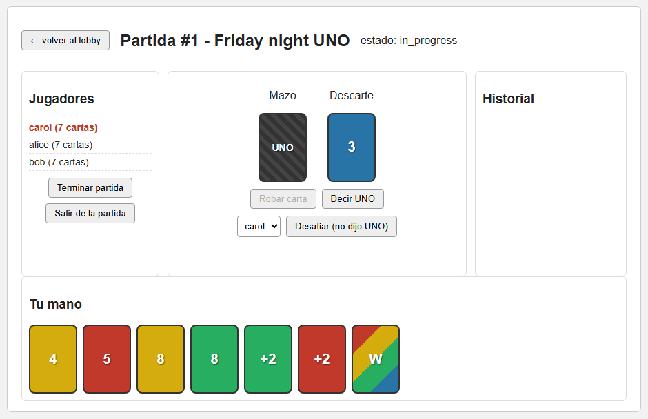
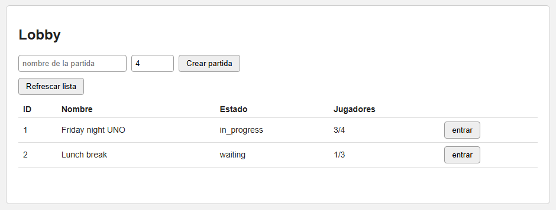

# UNO Game API

REST + WebSocket backend for a multiplayer UNO card game, with a small browser client and an
Electron desktop wrapper. Built as the capstone project for *Programación 4* at Jala University.

**Stack:** Node.js · Express 4 · Sequelize 6 (SQLite) · Socket.IO 4 · Winston · Jest + Supertest · Electron



<details>
<summary>Lobby</summary>



</details>

## Features

- **Auth:** register, login, logout and profile. Passwords are hashed with `crypto.scrypt`
  (random salt); login returns a random token that is sent in the `Authorization` header.
- **Game flow:** create, join, start, leave and end games; play a card, draw, say "UNO",
  challenge; query state, players, current player, top card, hand, scores and move history.
- **Rules engine:** number, `skip`, `reverse` (acts as skip with 2 players), `draw2`, `wild`
  and `wild4` cards. Deck generation uses a registry of card factories, so new card types can
  be added without touching `generateDeck`.
- **Real-time updates:** services publish to an internal event bus (`src/events/gameEvents.js`),
  and `src/sockets/gameSocket.js` relays `game:update` events to a Socket.IO room per game.
- **CRUD resources:** players, cards and scores.
- **Usage statistics:** every request (including 401s and cache hits) is tracked; `/api/stats`
  returns request counts, response times, status codes and the most popular endpoints.
- **In-memory GET cache** with expiry and size limit (`src/middlewares/memoize.js`).
- **Layered design:** routes → validators → controllers → services → repositories → models,
  with a small `Result` type for error handling. See [SOLID.md](SOLID.md) for how each SOLID
  principle maps to the code.

## Getting started

Requirements: Node.js 18+ (verified with Node 22) and npm.

```bash
npm install
cp .env.example .env      # PORT and DB_STORAGE (SQLite file path)
npm start                 # http://localhost:3000
```

- API root: `http://localhost:3000/api`
- Browser client: `http://localhost:3000/app`
- `npm run dev` starts the server with nodemon.
- `npm run desktop` opens the same client in an Electron window (it starts the server itself).

The database schema is created automatically on startup (`sequelize.sync()`).

## Tests

```bash
npm test                  # unit + integration (SQLite in memory)
npm run test:coverage     # with coverage report (threshold: 70%)
npm run test:e2e          # end-to-end suite only
```

Latest local run: **29 suites, 255 tests passing**.

A Postman collection (`postman_collection.json`) and a JMeter load-test plan
(`jmeter_test_plan.jmx`) are included.

## API overview

| Prefix | Endpoints |
|---|---|
| `/api/auth` | `POST /register`, `POST /login`, `POST /logout`, `GET /profile` |
| `/api/games` | `POST /`, `GET /`, `GET/PUT/DELETE /:id`, `POST /join`, `POST /start`, `POST /leave`, `POST /end`, `PUT /play`, `POST /draw`, `PATCH /uno`, `POST /challenge`, `GET /state`, `/players`, `/current-player`, `/top-card`, `/scores`, `/hand`, `/history` |
| `/api/turns` | `POST /next-turn`, `POST /play-card`, `POST /draw-card` |
| `/api/players` | CRUD |
| `/api/cards` | `GET /game/:gameId`, `GET/PUT/DELETE /:id` |
| `/api/scores` | `POST /`, `GET /player/:playerId`, `GET/PUT/DELETE /:id` |
| `/api/stats` | `GET /requests`, `/response-times`, `/status-codes`, `/popular-endpoints` |

## Project structure

```
server.js            entry point (DB connect + sync, HTTP + Socket.IO server)
electron/main.js     desktop wrapper
public/              browser client (HTML/CSS/JS)
src/
  app.js             Express app (middleware, routes, error handler)
  createServer.js    HTTP server + Socket.IO
  config/            database and logger
  routes/            one router per resource
  validators/        request-shape validation
  controllers/       HTTP layer
  services/          business logic
  repositories/      data access built from small capability mixins (traits.js)
  models/            Sequelize models
  middlewares/       auth, cache, usage tracking
  sockets/ events/   real-time layer and internal event bus
  utils/             rules engine, deck, turn engine, scoring, Result
tests/               integration tests, tests/unit, tests/e2e
```

## License

[MIT](LICENSE) © 2026 Hector Hugo Naranjo

---

## Resumen en español

API REST + WebSockets para jugar UNO multijugador, con cliente web y versión de escritorio en
Electron. Proyecto final (capstone) de *Programación 4* en Jala University. Incluye registro y
login con contraseñas hasheadas, flujo completo de partida (unirse, jugar, robar, decir UNO,
desafiar), motor de reglas con cartas especiales, actualizaciones en tiempo real con Socket.IO,
estadísticas de uso de la API y caché en memoria. Arranque: `npm install`, copiar `.env.example`
a `.env` y `npm start`. Pruebas: `npm test` (255 pruebas).
